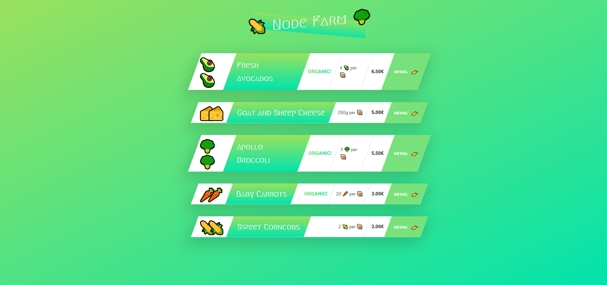
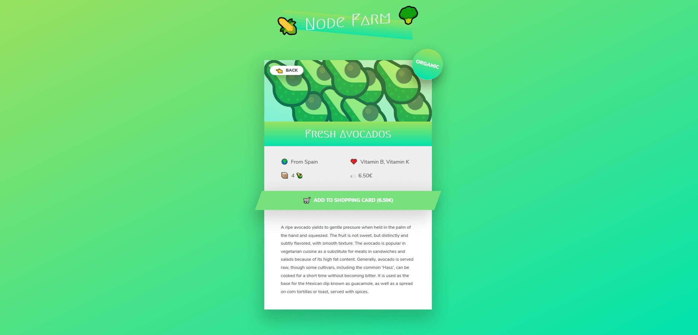
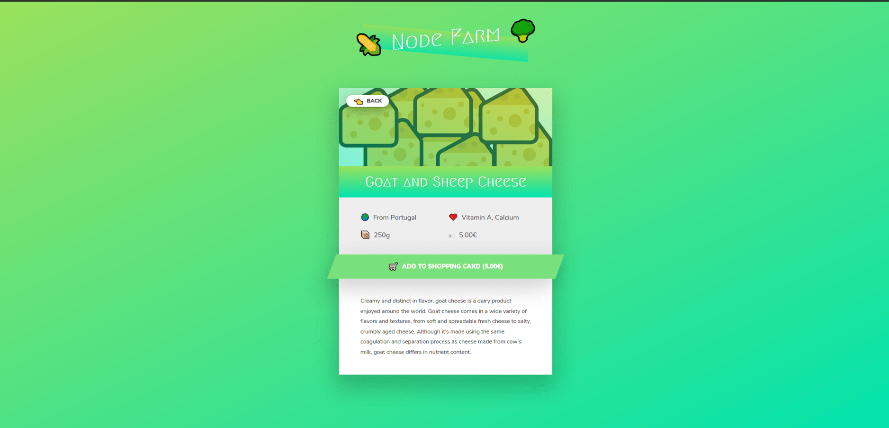
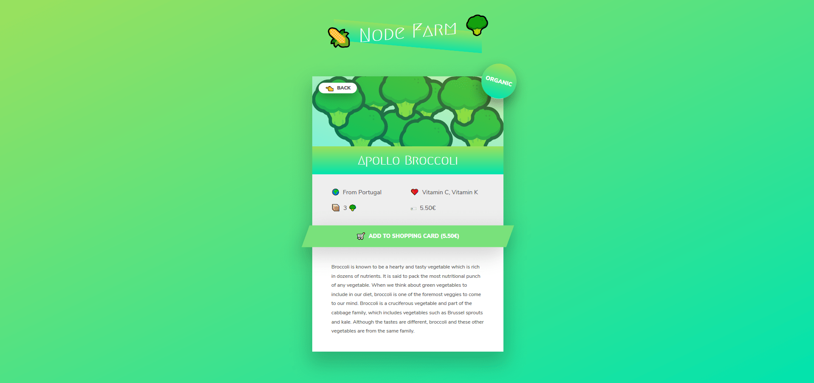
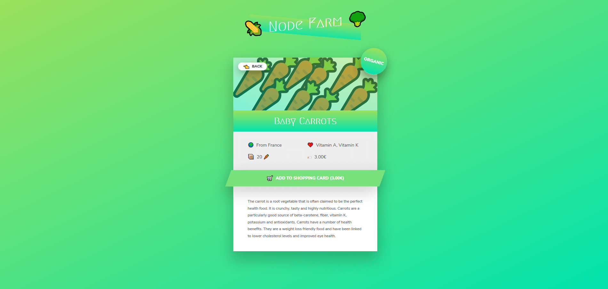
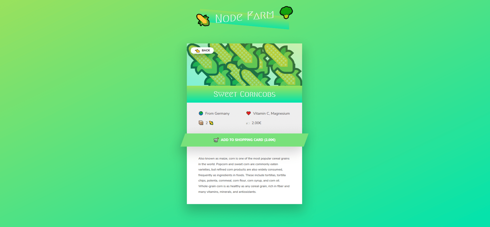

 # :corn: 1. Node Farm


  

## :wrench: How To Use

To clone and run this application, you'll need [Git](https://git-scm.com) and [Node.js](https://nodejs.org/en/download/) (which comes with [npm](http://npmjs.com)) installed on your computer. From your command line:

```bash
# Clone this repository
$ git clone git@github.com:rupesh1310/Learrning-NodeJS.git

# Go into the repository
$ cd filename 

# Install dependencies
$ npm install

# Run the app
$ npm start
```

#  :tv: Demonstration of UI






